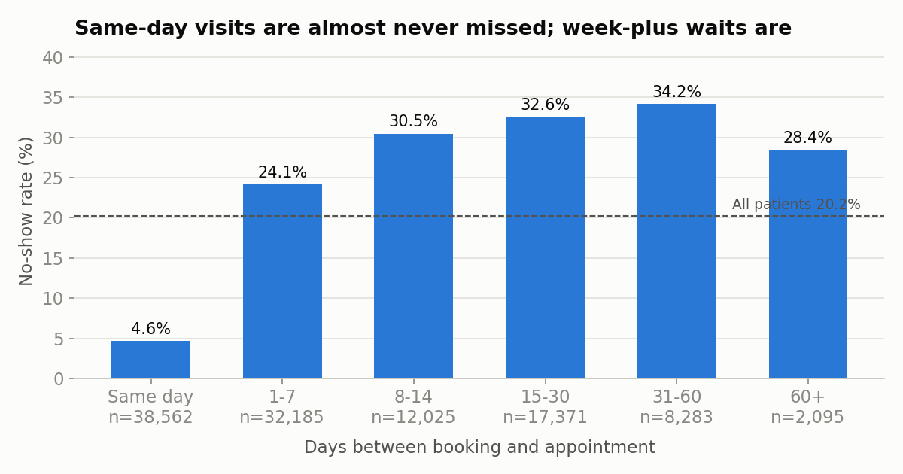
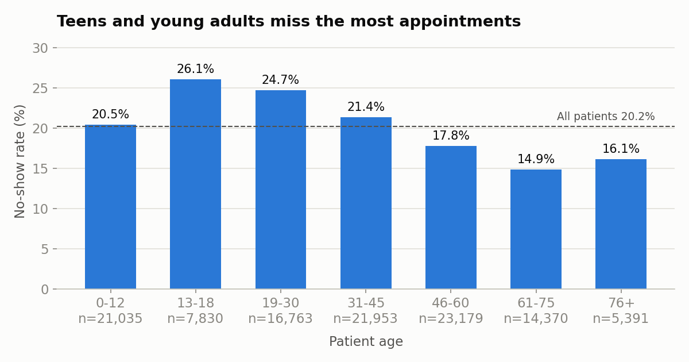
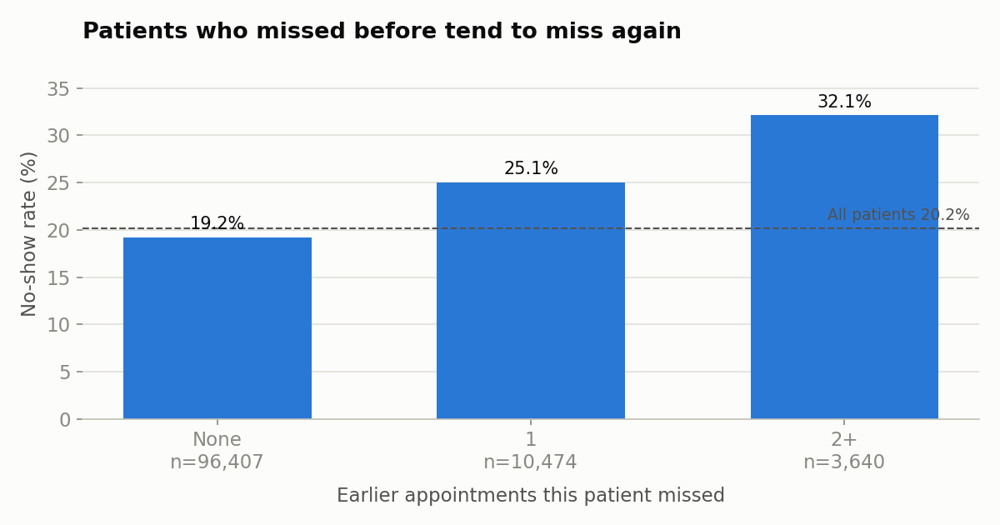
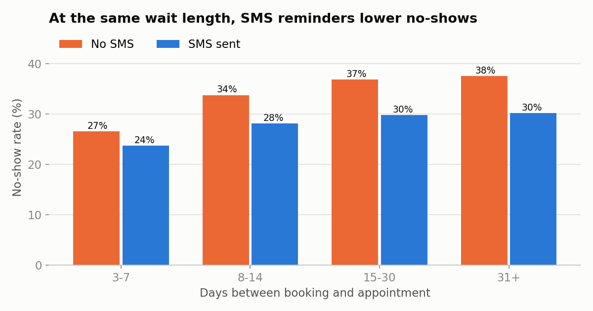
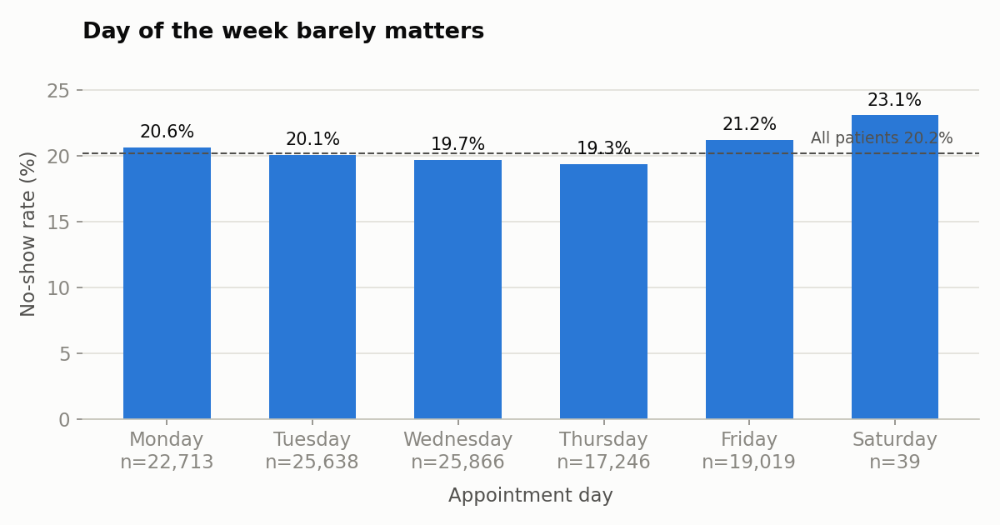
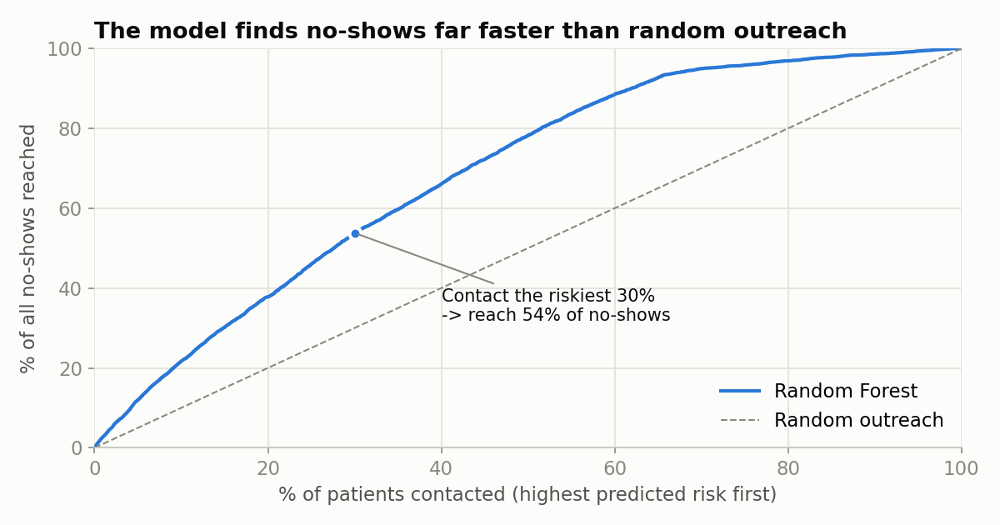
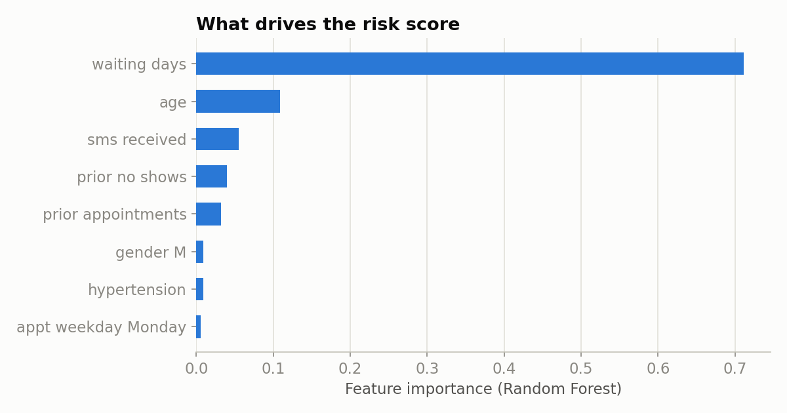

# Healthcare Appointment No-Show Analysis

**One in five patients misses their appointment. This project finds who is most likely to miss, and shows how a clinic can reach over half of its no-shows by contacting only the riskiest 30% of patients.**

Data: 110,521 appointments from public clinics in Vitória, Brazil (Kaggle, 2016) · Python, pandas, scikit-learn, matplotlib

📊 **Presentation:** [No-Show-Analysis.pptx](No-Show-Analysis.pptx), a 10-slide walkthrough of the business problem, EDA, model and recommendations

---

## 1. Business problem

A missed appointment is an empty slot that another patient could have used. Staff time is still paid, and the patient's care gets delayed. In this dataset **20.2% of appointments were missed**.

A clinic can't afford to call every patient before every visit. So the real question is:

> **Which upcoming appointments are most likely to be missed, and what should the clinic do about them?**

---

## 2. Exploratory analysis

Every chart shows the **no-show rate** for each group. The dashed line is the overall average (20.2%).

### Wait time is the strongest signal



- **Same-day appointments are almost never missed (4.6%).** They're 35% of all bookings.
- Once the wait passes a week, **roughly 1 in 3 patients no-shows** (30–34%).
- **Takeaway:** the longer the gap between booking and visit, the more the patient needs a reminder.

### Teens and young adults miss the most



- **13–18 (26.1%) and 19–30 (24.7%)** have the highest no-show rates.
- Patients over 60 are the most reliable (15–16%).
- **Takeaway:** reminders for under-30s should use channels they actually respond to (text, WhatsApp). For minors, send them to the parent.

### Past behavior predicts future behavior



- Patients with **2+ earlier no-shows miss 32.1%** of the time, vs **19.2%** with a clean record.
- **Takeaway:** a patient's own history is cheap to track and worth flagging at booking.

### SMS reminders work, once you compare like with like



- At first glance SMS looks harmful: patients who got a text missed **27.6%**, vs **16.7%** without one. That's misleading, because SMS was only sent for appointments booked 3+ days ahead, and those have higher no-show rates anyway.
- Comparing **within the same wait length**, SMS lowers the no-show rate by **3–7 percentage points** in every group.
- **41% of patients booked 3+ days ahead never got an SMS.**
- **Takeaway:** send the SMS to every appointment booked 3+ days out.

### What doesn't matter much



- **Day of the week:** Monday–Friday all fall between 19.3% and 21.2%. Moving appointments to other days won't help.
- **Chronic conditions:** hypertension (17.3%) and diabetes (18.0%) patients actually miss *less* than average. Alcoholism makes no difference (20.1% vs 20.2%).

---

## 3. Model: a no-show risk score

**Purpose:** give every upcoming appointment a risk score, so staff can call the riskiest patients first instead of calling at random.

**Data preprocessing**
- Waiting days are calculated from calendar dates. The first version of this project subtracted timestamps, which turned every same-day booking into "−1 days" and dropped 38.5K rows (35% of the data). That bug is fixed here.
- Removed invalid ages. Built a **prior no-shows** feature per patient using only *earlier* appointments, so the model never sees the future.
- About 80% of patients show up, so a model that always predicts "will show" is already **79.8% accurate** and catches nobody. That's why **accuracy is not used to judge the models.** Class imbalance is handled with `class_weight="balanced"`.

**Results** (20% held-out test set)

| Model | ROC-AUC | Recall (no-shows) | Precision (no-shows) |
|---|---|---|---|
| Logistic Regression | 0.68 | 58% | 32% |
| Decision Tree | 0.73 | 81% | 30% |
| **Random Forest** | **0.74** | **82%** | **31%** |



**What this means in practice:** ranking patients by Random Forest risk and contacting the top 30% reaches **54% of all no-shows**. Random calling would reach 30%. The top 10% alone contains 22% of no-shows.



**Key factors:** waiting days dominate, followed by age, SMS status and the patient's no-show history. This matches the EDA, so the model is picking up the same patterns the charts show.

---

## 4. Key insights & recommendations

| # | Insight | Recommendation |
|---|---|---|
| 1 | The model's top 30% riskiest appointments contain 54% of no-shows | **Score appointments nightly and have staff call the top 30%**, highest risk first |
| 2 | Same-day visits: 4.6% no-show. Week-plus waits: 30%+ | **Open more same-day or short-notice slots**, and send a confirmation request for anything booked more than 7 days out |
| 3 | SMS lowers no-shows 3–7 pts, but 41% of eligible patients never got one | **Send the SMS to every appointment booked 3+ days ahead.** Cheapest fix on the list |
| 4 | Under-30s and repeat no-showers miss most | **Flag these patients at booking** for an extra reminder, sent to the parent for minors |
| 5 | Weekday and chronic conditions barely matter | **Don't spend effort** rescheduling by weekday or targeting by diagnosis |

**Limitations:** this is observational data from one city in 2016. The SMS effect is a correlation within wait bands, not a controlled experiment. A clinic should pilot recommendations 1 and 3 as an A/B test before rolling them out.

---

## How to run

```bash
pip install -r requirements.txt
python no_show_analysis.py
```
This regenerates all charts in `charts/` and writes every number used in this README to `results/metrics.json`.

## Project structure
```
no_show_analysis.py     cleaning, EDA charts, models, business metrics
KaggleV2-May-2016.csv   raw data (110,527 appointments)
charts/                 figures used above
results/metrics.json    all numbers quoted in this README
No-Show-Analysis.pptx   slide deck version of this analysis
```

---

**Naga Sai Dintakurthi** · [LinkedIn](https://www.linkedin.com/in/naga-sai-dintakurthi-data-analyst/) · [GitHub](https://github.com/nagasai-data) · nagasaidintakurthi@gmail.com
