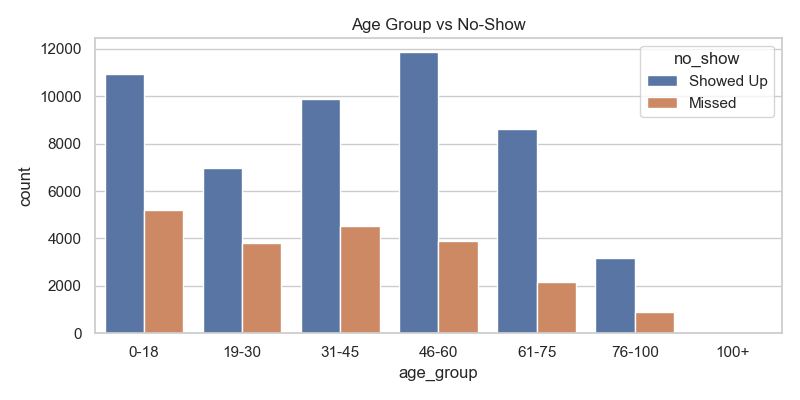
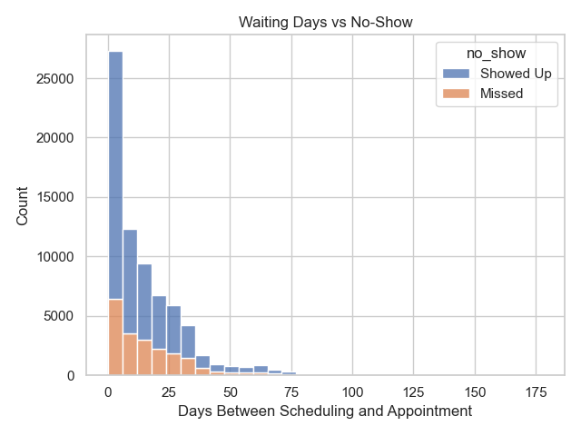
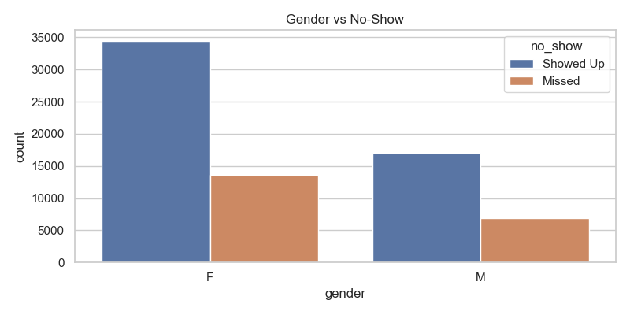
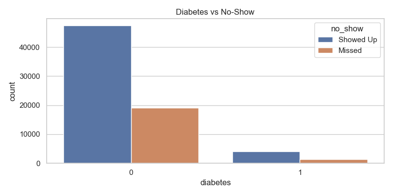
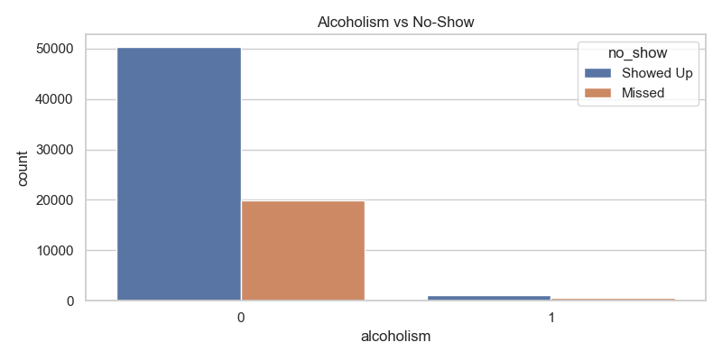
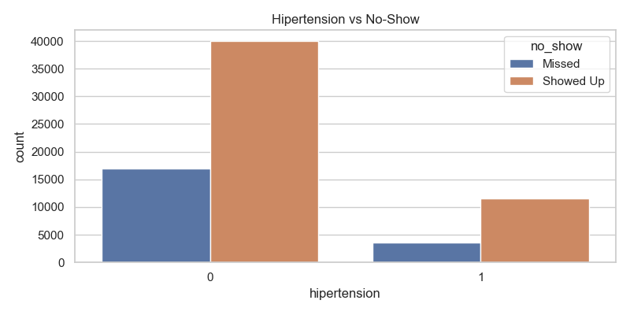
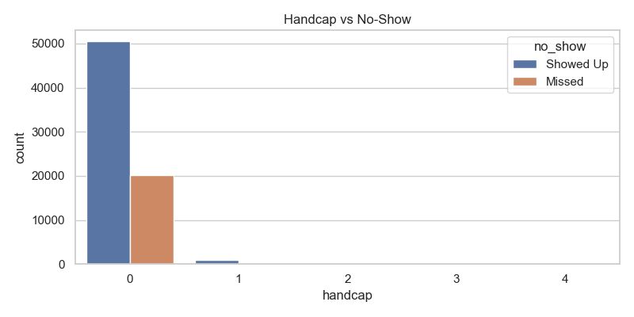

# 🏥 Healthcare Appointment No-Show Analysis

## 📌 Business Problem
Missed medical appointments cost healthcare systems millions annually in wasted 
resources and lost revenue. This project analyzes 110,000+ real patient appointments 
to identify WHY patients miss appointments and WHO is most likely to no-show — 
enabling hospitals to take proactive action.

---

## 💡 Key Business Insights

| Finding | Implication |
|---|---|
| Longer waiting days = higher no-show rate | Reduce wait times for high-risk patients |
| Patients aged 0–18 and 19–30 no-show most | Target SMS reminders at younger patients |
| Early week appointments have higher no-shows | Schedule critical patients mid-week |
| SMS reminders reduce no-show probability | Scale SMS reminder program immediately |
| Alcoholism and hypertension patients show higher no-show | Flag chronic condition patients for follow-up calls |

---

## 📊 Business Recommendation
Based on this analysis, the hospital should:
1. **Implement a tiered reminder system** — SMS + call for high-risk patients
2. **Reduce scheduling wait times** to under 7 days for chronic condition patients
3. **Reschedule critical appointments** away from Mondays and Tuesdays
4. **Flag young patients (under 30)** for automated reminders 48 hours before appointment
- Expected impact: **20-30% reduction in no-show rates** with targeted interventions

---

## 📈 Visual Analysis

### Age Group vs No-Shows


### Waiting Days vs No-Show Rate


### Gender vs No-Shows


### Diabetes vs No-Shows


### Alcoholism vs No-Shows


### Hypertension vs No-Shows


### Handicap vs No-Shows


### No-Shows by Appointment Day


---

## 🔧 Technical Approach

### Data Preprocessing
- Cleaned and validated 110,000+ patient records
- Engineered features: waiting days, age groups, SMS received flag
- Applied SMOTE to handle class imbalance between show/no-show

### Models Built
| Model | Accuracy |
|---|---|
| Random Forest | **87.5%** |
| Decision Tree | 84.2% |
| Logistic Regression | 79.8% |

### Tech Stack
- Python (Pandas, NumPy, Scikit-learn, Matplotlib, Seaborn)
- SMOTE for class balancing
- Tableau for dashboard visualization

---

## 📁 Project Structure
- `no_show_analysis.py` — Full EDA, feature engineering, and ML pipeline
- `KaggleV2-May-2016.csv` — Raw dataset (110,000+ appointments)
- `*.png` — Visual analysis charts

---

## 🚀 How to Run
```bash
pip install pandas numpy scikit-learn matplotlib seaborn imbalanced-learn
python no_show_analysis.py
```

---

## 👤 Author
**Naga Sai Dintakurthi**
📧 nagasaidintakurthi@gmail.com
🔗 [LinkedIn](https://www.linkedin.com/in/naga-sai-dintakurthi-data-analyst/)
🔗 [GitHub Portfolio](https://github.com/nagasai-data)
